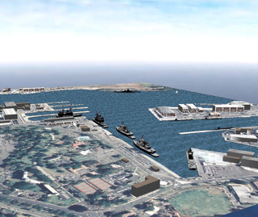
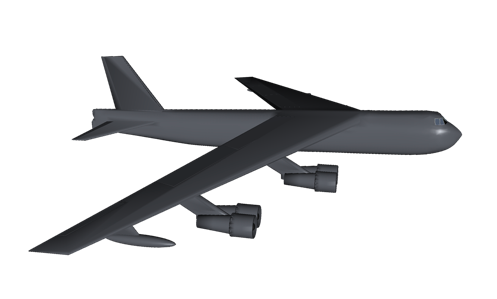
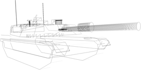

# About Open-DIS

[DIS](https://en.wikipedia.org/wiki/Distributed_Interactive_Simulation) is one of the most widely used protocols in Department of Defense, NATO, and allied nations real time/virtual world modeling and simulation. Open-DIS is a free, open source implementation of the standard in Java, C++, Python, JavaScript, Objective-C and C#.  The project uses a BSD-style open source license, which is non-viral and business-friendly.

Open-DIS is developed mainly by the [MOVES Institute at the Naval Postgraduate School](https://www.movesinstitute.org). Participation by other individuals and groups is welcome and encouraged.

Find us on [GitHub](https://github.com/open-dis).

# Distributed Interactive Simulation

DIS is an IEEE standard (IEEE-1278.1) developed by the Simulation Interoperability Standards Group (SISO) and approved by IEEE. It is very widely used in real time, virtual world military simulations. 

DIS is a network protocol. It describes the exact layout of a few dozen Protocol Data Units (PDUs) that contain information about the position and orientation of entities in the world, and much else. The are PDUs that describe electronic warfare, logistics, collisions, and simulation management.

* [DIS Plain and Simple: an Introduction to DIS](https://www.google.ca/url?sa=t&rct=j&q=&esrc=s&source=web&cd=1&ved=0ahUKEwjQs8HsoPvVAhVi4IMKHZHyC_cQFggoMAA&url=https%3A%2F%2Fwww.sisostds.org%2FDigitalLibrary.aspx%3FCommand%3DCore_Download%26EntryId%3D29302&usg=AFQjCNHbhiBCVmEDrTaWZBD2tFUWKg4yVw)
* [SISO DIS Protocol Support Group](https://www.sisostds.org/StandardsActivities/SupportGroups/DISRPRFOMPSG.aspx)
* [SISO DIS Protocol Development Group (Members Only)](http://www.sisostds.org/index.php?tg=articles&idx=More&topics=22&article=44)
* [Wikipedia DIS Page](http://en.wikipedia.org/wiki/Distributed_Interactive_Simulation)
* [Virtual Combat by David Neyland](http://www.amazon.com/Virtual-Combat-Distributed-Interactive-Simulation/dp/0811731251/ref=pd_bbs_sr_1?ie=UTF8&s=books&qid=1236275434&sr=8-1)

# Collaboration

We are interested in further implementation of the DIS standard for open source release. If you have a feature you want implemented we may be able to work with you to provide it, and also make it available to others.  We believe there is substantial benefit to the government and industry in having a complete, out-of-the-box open source implementation of DIS. This would allow programmers to concentrate on implementing new features in the simulation itself, rather than rewriting the DIS code yet again. 

Potential projects include implementing the DIS-200X standard now being developed in the SISO DIS Protocol Development Group, finishing some of the communications PDUs, implementing protocol finite state machines, bit-oriented subfields, testing and verification, an HLA gateway, and more.

Contact Don Brutzman (brutzman at nps dot edu) if you are interested in collaborative institutional efforts. NPS can accept a variety of funding vehicles from both government entities and private industry. Individuals who find the software useful can also contribute to the NPS Foundation via the link at left. 

Don McGregor (mcgredo at nps dot edu) is the technical lead for the project.

* [Don Brutzman Web Page: Institutional Collaboration](http://faculty.nps.edu/brutzman/brutzman.html)
* [NPS Foundation Donations](http://www.npsfoundation.org/donate)

# Papers & Presentations

Papers

Several people have put together various papers and powerpoint presentations over the course of developing the software. Some links to them are at left.

One of the themes MOVES has been working on the near-universal representation of data in XML format. To this end we have a marshaling option for DIS PDUs that writes out the contents of the PDU in XML format. Once in XML format we can use all the usual XML tools on it, including XSLT, XML-to-SQL tools, and so on.

Using XML format DIS PDUs in the realtime applications rather than merely as an archive format is clearly a challenge; DIS is sent in volume over the network, needs to be parsed in real time, and XML representations of the DIS data are about an order of magnitude larger than the IEEE format.

The W3C has been working on the Efficient XML Interchange format, an alternate encoding for XML that is more compact, in exchange for giving up XML’s text-only requirement. XML-format DIS encoded with EXI is about the same size as IEEE-format DIS, while retaining the benefits of being represented in XML format.

* [SISO Paper on Open-DIS](SisoDISPaper.pdf)
* [Open-DIS flyer](Open-DIS-flyer.pdf)
* [Open-DIS Powerpoint Open-DIS.ppt](Open-DIS.ppt)
* [Efficient XML Interchange (EXI)  and DIS](ExiComparisons.ppt)
* [Efficient XML Interchange Introduction--W3C standard for a more compact representation of XML](ExiLecture.ppt)
* [IEEE VR 2010 Paper from the University of Louisiana: Integrating the DIS Standards Into a Fully-Immersive Simulation Application](searis_paper40-1.pdf)
* [IEEE VR 2010 Presentation from Univ. of Louisiana](SEARIS2010-1.pdf)

# Developers

## Don McGregor

Don McGregor is a software developer at the Naval Postgraduate School. He created the Open-DIS project after becoming annoyed at the lack of an open source implementation. He is primarily to blame for the Java implementation.

## John Grant

John Grant is a former developer for the Delta3D game engine who has now gone on to grab some of the filthy lucre offered by private industry. He specified much of the C++ code interface and integrated Open-DIS into the Delta3D game engine.

## Peter Smith

Peter Smith is Electronics Engineer and Software Developer who works for the Naval Air Warfare Center.  He has done the work on the C# Open DIS implementation.

## Robert Harder

Robert Harder is an officer in the US Air Force. He implemented a Java NIO marshalling API that reduced memory use in real-time applications.

## Sheldon Snyder

Sheldon Snyder is a a US Navy Officer. He implemented a dead reckoning library in Java.

## Dioselin Gonzalez

Dioselin Gonzalez is a research scientist/software developer in the University of Louisiana at Lafayette. She specializes in collaborative virtual reality. Dio implemented C++ enumerations.

## Don Brutzman

Don Brutzman is a is Technical Director of for 3D Visual Simulation at the MOVES Institute. He is an Associate Professor at the Naval Postgraduate School in Monterey, California. Professor Brutzman kept on asking why there wasn’t an open source implementation of DIS, and why it couldn’t be also be represented in XML. He also has a longstanding interest in compact representations of XML, such as EXI, and in applying web services to DoD Modeling and Simulation.

## Leif Gruenwoldt

Leif Gruenwoldt is a software developer employed as an embedded contractor for the Department of National Defence, Canada. He is primarly responsible for maintaining the Java implementation which has included migrating the build system to Maven, publishing artifacts to Maven Central, adding JUnit tests, squashing bugs, and enabling continous integration with Travis CI. He is responsible for maintaining open-dis.org. And he helped migrate from SourceForge to GitHub. 

# Users

As a general rule, users in the DoD world keep quiet. If you’d like your project advertised, send in a link.

## AUV Workbench

AUV Workbench is a tool for rehearsal and playback of autonomous vehicle operations. AUV Workbench makes use of both the binary and XML serialization formats. It can send both IEEE binary and XML formats, and can send messages over XMPP chat rooms.
 
## X3D-Edit

X3D-Edit is a tool for writing X3D models. X3D-Edit can also generate, record, and play back DIS, and visualize the movement in an X3D scene.

## Delta3D

Delta3D is an open source game engine. It uses the C++ implementation of C++ as one of its communications protocols (in addition to HLA).
